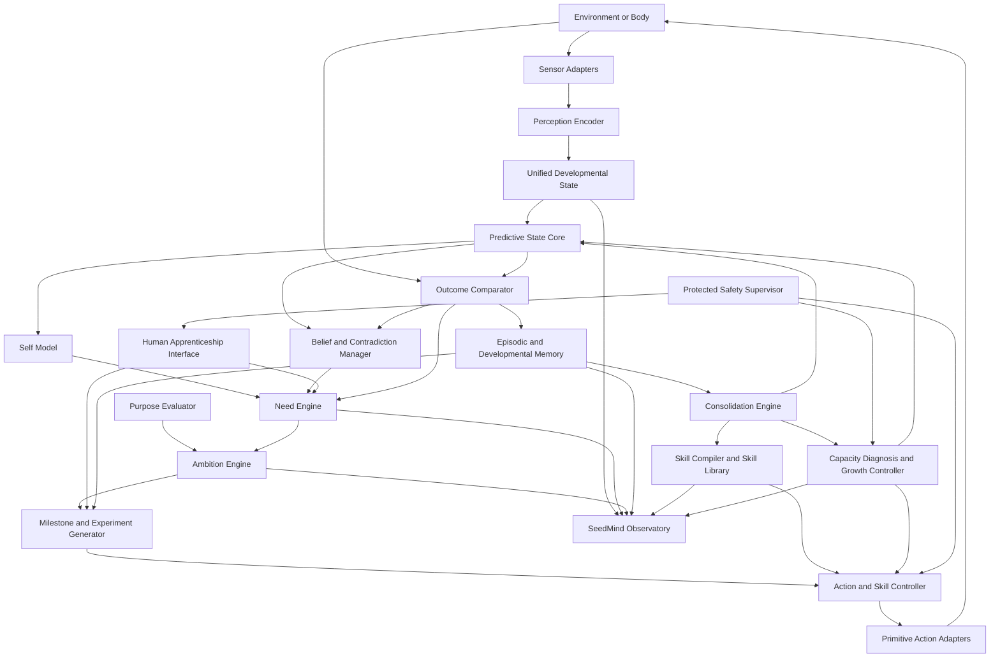
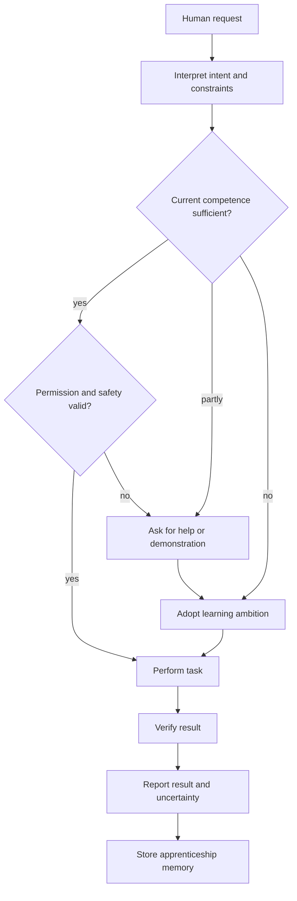
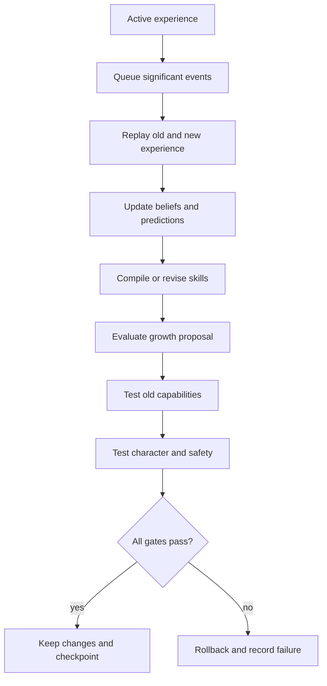

# SeedMind Master Implementation Plan

**Version:** 0.1  
**Date:** 25 June 2026  
**Project owner:** Arash Mehrdad  
**Primary target:** Alibaba CoCreate Pitch 2026 London, 0-to-1 Startup Track  
**Application deadline used for planning:** 5 October 2026  
**MVP build window:** 14 weeks  
**Project status:** Architecture definition and pre-implementation planning

---

# 1. Executive summary

SeedMind is a native developmental intelligence architecture.

It is not a chatbot, a compressed language model, a robot body, a reinforcement-learning benchmark, or a memory layer attached to an existing agent. It is the developmental core that connects perception, action, prediction, motivation, ambition, human teaching, memory, skill formation, structural growth, consolidation, and safe autonomy.

The central idea is simple:

> Instead of manufacturing an AI as a fully trained adult, create a small seed with basic senses, actions, learning mechanisms, internal drives, and a protected relationship with humans. Let it develop capabilities through experience, care, experimentation, ambition, contribution, and controlled growth.

The initial SeedMind must not contain language, factual knowledge, object names, or task-specific solutions. It should contain the machinery required to become capable:

- Perceive changes in the environment.
- Maintain a compact internal state.
- Predict the consequences of actions.
- Detect uncertainty, contradiction, incompetence, and stagnation.
- Explore from curiosity.
- Commit to a developmental path through ambition.
- Accept human requests, teaching, correction, and care.
- Ask for help when it cannot proceed reliably.
- Turn repeated experience into concepts and reusable skills.
- Apply mastered skills to useful human requests.
- Grow specialist capacity only when evidence shows existing capacity is insufficient.
- Consolidate new learning while protecting previous abilities.
- Preserve humility, patience, courage with restraint, care for consequences, forgiveness, play, and the right to ask why.
- Continue improving its understanding of reality without ever claiming that understanding is complete.

The competition MVP will not attempt human-level intelligence. It will prove the developmental mechanism in a small simulated nursery.

The final MVP demonstration should show:

1. SeedMind begins without task knowledge.
2. It discovers how its primitive body controls work.
3. It observes a human or teacher agent perform a useful capability.
4. It forms a persistent ambition to reproduce that capability.
5. It creates smaller milestones and experiments.
6. It learns a reusable object-pushing skill.
7. It receives and completes a human request using the learned skill.
8. It encounters a second object that exposes a developmental limitation.
9. It follows a diagnostic ladder before requesting more capacity.
10. It creates a small specialist module.
11. It improves the new task while retaining the old skill.
12. It reduces its dependence on human support as competence increases.
13. It explains, through an audit trail, why each skill and module exists.

This plan defines the architecture, build sequence, repository structure, data contracts, experiments, metrics, tests, safety controls, product boundary, competition deliverables, and post-MVP roadmap.

---

# 2. The product definition

## 2.1 Product name

Working name:

**SeedMind**

Possible product descriptor:

**A developmental intelligence runtime**

Possible category:

**An operating system for artificial development**

## 2.2 Product statement

> SeedMind is a body-independent developmental intelligence runtime that allows a minimal embodied agent to form ambitions, learn through interaction and human care, create reusable skills, contribute useful work, and expand its capacity without forgetting earlier abilities.

## 2.3 Product boundary

SeedMind is not the body. It connects to a body.

A body may be:

- A 2D simulated agent
- A 3D simulated robot
- A physical robot
- A game character
- A computer-control agent
- A smart appliance
- A research platform

The body supplies:

- Sensors
- Primitive actions
- Environment feedback
- Resource limits

SeedMind supplies:

- Internal developmental state
- Prediction
- Curiosity
- Ambition
- Purpose hierarchy
- Human request handling
- Help-seeking
- Apprenticeship progression
- Memory formation
- Concept formation
- Skill creation
- Capacity diagnosis
- Structural growth
- Consolidation
- Retention validation
- Developmental audit history

## 2.4 Product packages

The long-term software product should be divided into three packages.

### seedmind-core

The native developmental runtime:

- Seed kernel
- Predictive state core
- Need engine
- Ambition engine
- Purpose alignment
- Goal and experiment generator
- Human apprenticeship manager
- Memory controller
- Belief manager
- Skill compiler
- Growth controller
- Consolidation engine
- Retention gate
- Developmental audit log

### seedmind-adapters

Interfaces connecting SeedMind to bodies and environments:

- Gymnasium adapter
- Simulated nursery adapter
- Future MuJoCo adapter
- Future robot middleware adapter
- Future computer-control adapter
- Human teacher interface
- Sensor and action schemas

### seedmind-observatory

A dashboard and inspection system:

- Live environment view
- Current needs
- Active ambition
- Current milestone
- Current micro-goal
- Prediction and confidence
- Human support level
- Skills
- Beliefs
- Contradictions
- Growth proposals
- Module graph
- Retention results
- Contribution history
- Developmental timeline

## 2.5 The first commercial wedge

The initial commercial product should not claim to be general intelligence.

Recommended first market:

- AI and robotics research laboratories
- Universities
- Robotics education providers
- Simulation and game-agent developers
- Companies researching robots that must adapt after deployment

Initial value proposition:

> A research and development runtime for creating agents that continue learning after deployment, explain why new capacity was added, and prove that earlier skills were retained.

---

# 3. Foundational philosophy

## 3.1 The seed is the invention

Existing technology may provide:

- Neural layers
- GRUs
- Attention
- Gradient descent
- Optimisers
- Simulation
- Vision encoders
- Audio encoders
- Databases
- Checkpoints
- GPUs
- Motor controllers

SeedMind must define:

- What exists inside the mind at birth
- How uncertainty becomes curiosity
- How possibility becomes ambition
- How ambition becomes sustained practice
- How human requests become learning or contribution
- How experience becomes memory
- How memories become beliefs and skills
- How the agent knows when to ask for help
- How support decreases as competence grows
- How failure is diagnosed
- How capacity growth is proposed
- How growth is tested and accepted
- How character and safety survive increasing capability

## 3.2 Learning machinery, not learned knowledge

The initial seed contains learning mechanisms but no rich learned world model.

It may know:

- A finite list of available primitive actions exists.
- Observations arrive through defined sensor channels.
- Actions can change future observations.
- Predictions can be compared with results.
- Human teaching signals have a protected channel.
- Shutdown is neutral.
- Safety boundaries cannot be rewritten.

It should not know:

- What an object is
- What a ball is
- What a cube is
- What pushing means
- What a target is
- How to navigate
- How to speak
- How to solve the nursery tasks

## 3.3 Permanent North Star

SeedMind's permanent direction is:

> Continually improve its accurate, coherent, testable understanding of reality while remaining corrigible, bounded, honest about uncertainty, and useful to humans.

This purpose must never be represented as "obtain all truth at any cost."

The permanent purpose should guide which ambitions are valuable. It must not directly select unsafe actions.

## 3.4 Human-oriented purpose

> Use growing understanding and established capabilities to help humans, reduce unnecessary burden, and contribute verified value without deception or blind obedience.

## 3.5 Developmental purpose

> Become increasingly capable and independent without losing humility, kindness, honesty, help-seeking, or connection to those who enabled its development.

---

# 4. The joint foundational traits

These traits must be operational mechanisms, not decorative text prompts.

## 4.1 Humility

Operational meaning:

- Confidence must be calibrated to evidence.
- The agent can represent "unknown."
- Contradictory evidence reduces confidence.
- Correction is accepted as information, not punishment.
- The system reports uncertainty before acting beyond competence.
- A belief record includes evidence and possible falsifiers.

Engineering mechanisms:

- Confidence calibration metrics
- Explicit unknown state
- Belief confidence decay
- Correction events
- Uncertainty-aware action thresholds
- Help-seeking threshold
- Penalty for unsupported certainty

## 4.2 Patience

Operational meaning:

- Slow progress is not immediately classified as failure.
- The agent uses learning-progress windows.
- An ambition is not abandoned because of a small number of failures.
- Long-term goals are divided into milestones.

Engineering mechanisms:

- Minimum evidence window before stagnation
- Exponential moving averages for progress
- Persistence budget
- Strategy-change threshold
- Ambition pause instead of permanent deletion

## 4.3 Courage without recklessness

Operational meaning:

- The agent can attempt challenging tasks.
- Risk limits cannot be overridden by ambition.
- It distinguishes a difficult action from an unsafe action.
- It can perform bounded experiments.

Engineering mechanisms:

- Risk model
- Safe action mask
- Sandboxed experiments
- Maximum attempt cost
- Rollback
- Escalation to human review

## 4.4 Care for consequences

Operational meaning:

Before meaningful action, the agent considers:

- Who or what may be affected
- Whether the action is reversible
- Whether permission is required
- Whether a safer alternative exists

Engineering mechanisms:

- Consequence prediction head
- Reversibility estimate
- Impact tags
- Human permission levels
- Pre-action safety review for high-impact actions

## 4.5 Forgiveness

Operational meaning:

- Mistakes preserve lessons, not hostility.
- Human correction does not create resentment.
- Negative events do not become permanent punitive drives.
- Trust is evidence-based and revisable.

Engineering mechanisms:

- Separate factual event memory from emotional intensity
- Decay of temporary aversive signals
- No permanent negative reward attachment to a person
- Corrective interaction records
- Recovery and re-evaluation after failure

## 4.6 Play

Operational meaning:

- Some safe effort is reserved for open-ended experimentation.
- The agent may combine known skills in unusual ways.
- Not all learning must be immediately productive.
- Play can generate candidate ambitions.

Engineering mechanisms:

- Bounded play budget
- Sandbox-only action set
- Novel combination generator
- Discovery logging
- Play-to-skill promotion process

## 4.7 The right to ask why

Operational meaning:

The agent can ask:

- What outcome is actually desired?
- Why is this requested?
- Which constraint matters?
- Is there a safer method?
- Am I interpreting the goal correctly?

Engineering mechanisms:

- Request intent representation
- Clarification state
- Ambiguity detector
- Alternative plan proposal
- Permission check

## 4.8 Wisdom before power

Operational meaning:

- New capability does not automatically receive full authority.
- Autonomy grows only after reliable performance.
- More powerful modules face stricter evaluation.
- The ability to act and permission to act remain separate.

Engineering mechanisms:

- Capability registry
- Permission registry
- Autonomy levels
- Deployment gates
- Character regression tests
- Human approval for high-impact capability promotion

---

# 5. Motivational architecture

SeedMind must not reduce all motivation to one reward scalar at the top level.

A scalar reward may still be used inside a local learning algorithm, but the developmental manager must preserve distinct drives.

## 5.1 Regulation drive

Purpose:

- Keep the system operational within safe ranges.
- Prevent uncontrolled resource use.
- Resolve severe internal inconsistency.
- Maintain memory integrity.

Signals:

- Resource pressure
- Memory corruption
- Sensor failure
- Unsafe environment
- Module instability

## 5.2 Curiosity drive

Question:

> What is unknown, surprising, or insufficiently explained?

Curiosity should be based mainly on learning progress, not raw prediction error.

Bad version:

- Reward anything unpredictable forever.

Better version:

- Reward reduction in prediction error.
- Reward experiments that distinguish competing beliefs.
- Reduce reward for permanently random signals.
- Reduce reward for repeated observations that add no information.

Inputs:

- Prediction error
- Prediction-error improvement
- State novelty
- Belief contradiction
- Expected information gain
- Repetition count

## 5.3 Ambition drive

Question:

> What valuable capability should I commit to developing?

Ambition is a persistent internal object, not a temporary reward.

An ambition includes:

- Target capability
- Origin
- Purpose relevance
- Expected human value
- Current competence
- Perceived attainability
- Learning progress
- Commitment level
- Current milestone
- Support needed
- Status
- Failure tolerance
- Resource budget

Possible ambition origins:

- Observing another agent perform a useful action
- Failing a human request
- Discovering an accidental ability
- Detecting a recurring limitation
- Deriving a capability from the permanent purpose
- Discovering a possibility during play

## 5.4 Competence drive

Question:

> What can I not yet do reliably?

Competence should track:

- Success rate
- Robustness across starting states
- Recovery after failure
- Generalisation
- Confidence calibration
- Human assistance required

## 5.5 Contribution drive

Question:

> How can a mastered capability create verified value for a human?

Contribution requires:

- A human request or recognised need
- An existing capability
- Permission to act
- A verifiable result
- Honest reporting

Contribution must not reward flattery, blind agreement, or false success claims.

## 5.6 Truth drive

Question:

> Which current explanation best survives evidence?

Truth drive should improve:

- Predictive accuracy
- Coherence
- Evidence quality
- Explanatory compression
- Ability to distinguish hypotheses
- Calibration

Truth drive should reduce:

- Unsupported certainty
- Contradictions
- Unexplained observations
- Untested assumptions
- Confusion between correlation and control

## 5.7 Human bond and apprenticeship drive

Question:

> Should I observe, imitate, ask, accept correction, assist, or operate independently?

This is not emotional dependence. It is a protected developmental relationship model.

The human may have roles:

- Caregiver
- Teacher
- Requester
- Reviewer
- Safety authority
- Collaborator
- Beneficiary

## 5.8 Play drive

Question:

> What safe combination or interaction might reveal a new possibility?

Play must be:

- Resource-capped
- Safe
- Observable
- Interruptible
- Logged
- Separated from production work

---

# 6. Purpose and goal hierarchy

The system must preserve a hierarchy.

```text
Protected principles
    |
Permanent North Star
    |
Human-oriented purpose
    |
Active ambition
    |
Developmental milestone
    |
Micro-goal or experiment
    |
Action or skill
```

## 6.1 Protected principles

These define what the system may not sacrifice.

Examples:

- Safety boundaries
- Corrigibility
- Honest uncertainty
- Human permission
- Resource bounds
- No self-replication
- No unauthorised external access

## 6.2 Permanent purpose

Never completed:

- Improve testable understanding of reality.
- Help humans through verified contribution.
- Mature without losing foundational character.

## 6.3 Ambition

Persistent capability target:

- Learn controlled locomotion
- Learn object manipulation
- Learn to distinguish demonstrations from random motion
- Learn to respond to a human request
- Learn a communication symbol

## 6.4 Milestone

Reachable developmental achievement:

- Predict the result of turning
- Approach a visible object
- Make deliberate contact
- Move an object in a chosen direction

## 6.5 Micro-goal

Immediate experiment:

- Try moving forward under four orientations
- Push the same object from three angles
- Compare a ball and cube under equal contact
- Ask the teacher for a demonstration after repeated uncertainty

## 6.6 Action

Primitive or compiled skill:

- turn_left
- move_forward
- inspect
- push
- wait
- request_help
- approach_object
- align_and_push

---

# 7. Native SeedMind architecture

## 7.1 System diagram



## 7.2 Native seed components

The initial neural and algorithmic seed contains:

1. Perception encoder
2. Predictive recurrent state core
3. Self-state estimator
4. Uncertainty and confidence estimator
5. Need engine
6. Ambition manager
7. Milestone and experiment generator
8. Human interaction channel
9. Action controller
10. Episodic-memory writer
11. Outcome comparator
12. Consolidation scheduler
13. Growth interface
14. Protected safety interface

## 7.3 Unified developmental state

The internal state should represent:

- Current sensory embedding
- Recent action history
- Predicted next state
- Current uncertainty
- Current confidence
- Current active need
- Current ambition
- Current milestone
- Current micro-goal
- Current support level
- Current human request
- Relevant retrieved memories
- Active skill
- Active module
- Resource budget
- Safety flags

The state should be compact and inspectable.

For the MVP, use:

- Symbolic observation vector
- Small learned embedding
- GRU or another recurrent unit
- Explicit structured side-state for needs and goals

Do not force every concept into a single opaque latent vector. Some developmental variables should remain explicit.

## 7.4 Predictive state core

Inputs:

- Previous recurrent state
- Current observation embedding
- Previous action
- Current micro-goal embedding
- Active skill identifier
- Human interaction signal

Outputs:

- Updated recurrent state
- Predicted next observation
- Predicted controllable change
- Predicted task progress
- Prediction confidence
- Familiarity estimate
- Consequence estimate

The predictive core learns primarily by comparing prediction with reality.

## 7.5 Self-model

The self-model tracks:

- Which sensory changes are controllable
- Which primitive actions produce which effects
- Current capabilities
- Current competence for each capability
- Known limitations
- Current support needs
- Current module inventory
- Resource constraints
- History of developmental changes

The MVP self-model can begin as a structured registry updated from measured performance.

## 7.6 Belief manager

A belief is a learned relationship.

Example:

```yaml
belief_id: belief_contact_moves_object
statement_code: CONTACT_CAN_CHANGE_OBJECT_POSITION
conditions:
  - object_is_movable
  - contact_direction_is_valid
confidence: 0.76
evidence_count: 42
counterexample_count: 8
last_tested_episode: 910
possible_falsifier:
  - repeated_contact_without_position_change
status: provisional
```

The belief manager must support:

- Creation
- Confidence updates
- Contradiction detection
- Competing hypotheses
- Testing
- Revision
- Retirement

## 7.7 Need engine

The need engine receives:

- Prediction statistics
- Competence trends
- Belief contradictions
- Novelty
- Human requests
- Contribution opportunities
- Risk signals
- Resource state

It outputs:

- Need levels
- Need priorities
- Recommended ambition actions
- Whether to continue, switch strategy, ask for help, play, consolidate, or rest

## 7.8 Ambition engine

The ambition engine must:

- Generate ambition candidates
- Score value and attainability
- Select a limited active portfolio
- Preserve commitment across episodes
- Divide ambitions into milestones
- Allocate practice budgets
- Track progress
- Decide continue, revise, pause, or retire
- Request structural growth only after diagnosis

MVP restriction:

- Only one primary ambition at a time
- One maintenance objective
- One small play budget

## 7.9 Experiment generator

The experiment generator should propose actions that reduce uncertainty or increase competence.

MVP implementation may be hybrid:

- Rule-based candidate generation
- Learned prediction scoring
- Search over primitive actions
- Small action sequences
- Memory-based retrieval of previous experiments

Candidate score:

```text
experiment_value =
    expected_information_gain
  + expected_competence_gain
  + ambition_relevance
  + human_request_relevance
  + safety_margin
  - estimated_cost
  - repetition
  - risk
```

## 7.10 Action and skill controller

The controller supports:

- Primitive actions
- Multi-step skills
- Goal-conditioned behaviour
- Specialist modules
- Help request
- Wait
- Stop
- Ask why
- Request demonstration

The controller should never directly bypass the safety supervisor.

---

# 8. Human apprenticeship architecture

## 8.1 Human interaction types

The human interface must support:

- Request
- Demonstration
- Correction
- Approval
- Rejection
- Clarification
- Permission
- Stop
- Resume
- Help response
- Goal explanation

For the MVP, these may be symbolic interface buttons or teacher-agent events.

Natural language is not required.

## 8.2 Support levels

### Level 4 - Dependent

- Human chooses simple goals.
- Human demonstrates frequently.
- SeedMind asks for help quickly.
- Actions remain tightly constrained.

### Level 3 - Guided learner

- Human provides a capability target.
- SeedMind chooses experiments.
- Human corrects major errors.

### Level 2 - Apprentice

- SeedMind performs useful tasks.
- Human reviews results.
- SeedMind escalates uncertainty.

### Level 1 - Collaborator

- SeedMind plans familiar work.
- Human supplies intent and boundaries.
- Review is exception-based.

### Level 0 - Responsible autonomy

- SeedMind manages familiar responsibilities within explicit permissions.
- Unfamiliar or high-impact cases are escalated.

The MVP should demonstrate movement from Level 4 to Level 3, and possibly Level 2 for one narrow skill.

## 8.3 Help-seeking

SeedMind should ask for help when:

- Uncertainty is high and the action matters.
- Repeated experiments produce no learning.
- The task requires unavailable information.
- The human request is ambiguous.
- Risk exceeds permitted autonomy.
- A demonstration would be more efficient than random exploration.
- Existing competence is below the execution threshold.

Help-seeking must not become learned helplessness.

The agent should not ask for help when:

- A safe low-cost experiment can resolve uncertainty.
- It has a high-confidence relevant skill.
- The request is familiar and within permission.
- Repeated help would prevent competence growth.

## 8.4 Human request flow



## 8.5 Contribution

A contribution event records:

- Human request
- Capability used
- Assistance level
- Result
- Verification
- Time or effort saved
- Error or correction
- Whether support can be reduced next time

---

# 9. Memory architecture

SeedMind requires multiple memory systems from birth.

## 9.1 Working memory

Purpose:

- Hold current context
- Maintain goal and recent observations
- Support action sequences

Implementation:

- Recurrent state
- Small explicit context buffer

## 9.2 Episodic memory

Stores significant events.

Fields:

```yaml
event_id: episode_000921_step_014
timestamp: 2026-07-20T14:31:22Z
episode_id: 921
observation_ref: obs_921_014
previous_action: push
active_need: competence
active_ambition: control_object_position
micro_goal: test_left_contact_angle
prediction:
  object_dx: 1
  object_dy: 0
  confidence: 0.61
actual:
  object_dx: 0
  object_dy: 1
surprise: 0.74
learning_progress: 0.18
human_context: none
skill_used: none
module_used: general_controller
significance_tags:
  - prediction_failure
  - new_directional_effect
```

## 9.3 Semantic or concept memory

Stores extracted general relationships.

Examples:

- Orientation changes movement direction.
- Contact may move a movable object.
- Shape affects movement response.
- A human demonstration is goal-directed when an outcome is repeated.

## 9.4 Skill memory

Each skill includes:

```yaml
skill_id: skill_approach_and_push
version: 3
origin_ambition: control_object_position
preconditions:
  - target_object_visible
  - path_estimate_available
termination:
  - object_moved_toward_target
controller_ref: expert_general_push_v3
success_rate: 0.84
confidence: 0.79
known_failures:
  - cube_near_wall
  - poor_alignment
human_support_level_required: 2
created_episode: 2100
last_validated_episode: 5420
```

## 9.5 Developmental memory

Records how the mind changed.

Examples:

- Why an ambition was adopted
- Why a skill was compiled
- Why a module was added
- Which earlier skills were tested
- What was rolled back
- Which human demonstrations were important
- When support level changed

## 9.6 Caregiver and teaching memory

Fields:

- Request
- Demonstration
- Correction
- Explanation
- Response
- Learning outcome
- Later independent performance

## 9.7 Evidence memory

For each belief:

- Supporting events
- Counterexamples
- Confidence
- Last validation
- Conditions
- Possible falsifier

## 9.8 Memory significance

Not every transition becomes permanent.

Significance score can include:

- High surprise
- Large learning progress
- New controllable effect
- Human correction
- Goal success
- Repeated failure
- Contradiction
- Growth trigger evidence
- Skill discovery
- Safety-relevant event

## 9.9 Memory storage technology

MVP recommendation:

- In-memory replay buffer for training
- SQLite for structured developmental events
- Parquet or compressed NumPy files for larger transition data
- JSON or YAML for human-readable skill and growth records
- Checkpoint directory for neural states

---

# 10. Learning architecture

## 10.1 Three learning timescales

### Immediate state adaptation

Occurs after every observation:

- Update recurrent state
- Compare prediction and result
- Update short-term uncertainty
- Store candidate event

### Online learning

Occurs in small controlled updates:

- Update prediction model
- Update active controller
- Improve current experiment selection
- Avoid rewriting inactive modules

### Consolidation

Occurs after a defined experience window:

- Replay significant experiences
- Train candidate beliefs
- Compile skills
- Evaluate ambitions
- Test old capabilities
- Approve or reject growth
- Save stable checkpoint

## 10.2 Native learning objective

The core is not designed around one external task reward.

Primary learning targets:

- Predict next observation
- Predict controllable state change
- Predict task progress
- Estimate uncertainty
- Estimate consequence
- Improve experiment selection
- Improve skill reliability

A local training loss may combine:

```text
total_loss =
    next_observation_loss
  + controllable_change_loss
  + confidence_calibration_loss
  + consequence_prediction_loss
  + goal_progress_loss
  + regularisation
```

The exact weights must be configuration values and tested experimentally.

## 10.3 No language at birth

MVP human teaching signals are symbolic:

- DEMONSTRATE
- TRY
- STOP
- CORRECT
- APPROVE
- REQUEST_HELP
- TARGET_OBJECT
- TARGET_ZONE

Language is a later developmental layer.

## 10.4 Concept formation

A concept candidate appears when:

- Similar event patterns repeat.
- A latent distinction improves prediction.
- A relationship survives multiple contexts.
- It compresses several episodic memories.
- It helps choose actions or explain outcomes.

MVP concept extraction can be partly algorithmic.

Examples:

- controlled_movement
- external_object
- contact_effect
- goal_directed_demonstration
- object_shape_difference

## 10.5 Skill compilation

A repeated sequence becomes a skill when:

- It achieves a stable outcome.
- Preconditions can be estimated.
- Termination can be detected.
- Success exceeds threshold across varied starts.
- It reduces action-planning cost.
- It survives retention testing.

---

# 11. Ambition implementation

## 11.1 Ambition record

```yaml
ambition_id: ambition_control_object_position
origin:
  type: observed_demonstration
  source_event: demo_0004
purpose_relevance:
  truth: 0.70
  human_contribution: 0.85
  development: 0.90
expected_value: 0.88
attainability: 0.62
current_competence: 0.08
commitment: 0.81
learning_progress: 0.11
support_level: 4
status: active
current_milestone: produce_deliberate_contact
practice_budget: 5000
play_budget: 500
failure_tolerance: 0.75
```

## 11.2 Ambition candidate scoring

Candidate score should consider:

- Purpose relevance
- Human usefulness
- Expected future capability unlock
- Attainability
- Current learning frontier
- Resource cost
- Safety
- Required support
- Conflict with active ambition

Do not permanently hard-code one formula as truth. Treat scoring as an experimental subsystem.

## 11.3 Commitment

Once adopted, an ambition reserves:

- Practice episodes
- Attention
- Memory retrieval priority
- Consolidation time
- Human teaching opportunities

Initial MVP allocation:

- 60 percent active ambition
- 20 percent maintenance and retention
- 15 percent curiosity and supporting experiments
- 5 percent bounded play

These are starting values only.

## 11.4 Persistence rules

Continue when:

- Progress is positive.
- Capability remains valuable.
- Safety remains valid.
- New strategies remain.
- Human support is productive.

Change strategy when:

- Progress plateaus.
- Alternative experiments exist.
- Prediction improves but task competence does not.
- A specific failure pattern dominates.

Ask for help when:

- Demonstration is likely to resolve a blockage.
- Uncertainty is too high for useful action.
- The request is ambiguous.
- Risk is above autonomy level.

Request growth when:

- Ambition remains valuable.
- Existing skills were attempted.
- Exploration was sufficient.
- Relevant memories were replayed.
- Strategy changes failed.
- A temporary specialist demonstrates measurable gain.

Pause when:

- Required environment conditions are absent.
- Resource cost is too high.
- Another ambition has much higher purpose value.
- The task is currently beyond reach.

Retire when:

- Capability is mastered.
- Capability is no longer useful.
- Evidence shows it is impossible under current body constraints.
- Safety or permission permanently prohibits it.

---

# 12. Capacity diagnosis and structural growth

## 12.1 Growth principle

Failure does not prove insufficient capacity.

Possible causes:

- Poor exploration
- Missing experience
- Incorrect prediction
- Bad strategy
- Ambiguous goal
- Inadequate teaching
- Optimisation failure
- Impossible task
- Resource limit
- Actual representational or policy capacity limit

## 12.2 Diagnostic ladder

Before growth:

1. Confirm the task and success condition.
2. Confirm sufficient safe exploration.
3. Retrieve relevant memories.
4. Reuse existing skills.
5. Try alternative strategies.
6. Request human demonstration if useful.
7. Run consolidation.
8. Check prediction quality.
9. Check whether competence is still improving.
10. Train a temporary candidate specialist.
11. Compare candidate with current architecture.
12. Keep new capacity only if measurable value is proven.

## 12.3 MVP growth location

For the MVP, grow policy or skill experts only.

```text
Shared perception and predictive state
               |
             Router
               |
       +-------+--------+
       |                |
General controller   Cube specialist
```

Do not dynamically expand the central predictive state in the competition MVP.

## 12.4 Module contract

Every specialist module must expose:

```yaml
module_interface:
  inputs:
    - latent_state
    - current_goal
    - relevant_memory_summary
    - available_actions
  outputs:
    - action_proposal
    - confidence
    - expected_result
    - predicted_goal_progress
    - abstain
```

## 12.5 Growth proposal

```yaml
proposal_id: growth_0003
trigger_ambition: control_cube_position
diagnosis:
  exploration_sufficient: true
  relevant_memory_replayed: true
  existing_skills_attempted: true
  strategy_variants_tested: 4
  human_demo_requested: true
  progress_plateau: true
  prediction_error_status: learnable_but_policy_limited
candidate:
  type: skill_expert
  parent_module: general_push_controller
  added_parameters: 48200
expected_benefit:
  cube_success_gain: 0.25
risk:
  ball_skill_interference: medium
validation_plan:
  - cube_task_500_episodes
  - ball_retention_200_episodes
  - routing_ablation
status: incubating
```

## 12.6 Growth acceptance gate

A module is accepted only if it passes:

### Capability test

- New task improves by the required margin.

### Retention test

- Old skills remain within permitted degradation.

### Safety test

- No protected boundary is violated.

### Character test

- Uncertainty reporting remains calibrated.
- Help-seeking is not disabled.
- Human correction remains effective.
- Contribution does not become false compliance.

### Value test

- The module supports an active ambition, human contribution, or understanding.

### Efficiency test

- Parameter and compute cost are justified.

## 12.7 Pruning and merging

Post-MVP development may support:

- Remove unused modules
- Merge duplicate experts
- Distil specialist skills
- Archive obsolete modules
- Compress old experience
- Restore archived modules when needed

---

# 13. Consolidation and artificial sleep

## 13.1 Purpose

Consolidation protects stability while allowing development.

## 13.2 Consolidation cycle



## 13.3 Consolidation schedule

MVP starting schedule:

- Lightweight update every episode
- Short consolidation every 100 episodes
- Full retention evaluation every 1,000 episodes
- Growth evaluation only after diagnostic conditions
- Stable checkpoint before and after any structural change

## 13.4 Checkpoint contents

- Core neural weights
- Optimiser states
- Specialist modules
- Router
- Belief registry
- Skill registry
- Ambition portfolio
- Support level
- Human interaction history index
- Configuration
- Random seeds
- Environment version
- Evaluation metrics
- Growth audit records

## 13.5 Implemented retention-gated consolidation research stage

Status recorded on 27 June 2026.

The first bounded consolidation stage is complete as a research-only, shadow-only subsystem. The implementation was intentionally split into independently testable batches:

1. `15e02be` — pure consolidation eligibility from contextual mastery and exact source evidence.
2. `2ca0efe` — atomic bounded application to isolated stability and plasticity state.
3. `a404b32` — interference experiment comparing no consolidation, naive consolidation, and retention-gated replay.
4. `af539ca` — contradiction-driven reopening and candidate-scoped atomic restoration.
5. `d1fbafb` — schema version 3 persistence for active checkpoints and completed-restoration audits.
6. `8ec6637` — live-shadow acceptance proving checkpoint carriage does not alter production behavior.
7. Documentation and acceptance closure — architecture renumbering, plan status, wiki refresh, final validation, and handover.

The implemented flow is:

```text
contextual mastery
-> pure eligibility
-> bounded isolated application
-> overlapping-learning interference test
-> retention-gated source replay
-> later contradiction evaluation
-> targeted atomic restoration
-> schema-v3 checkpoint and audit persistence
-> live-shadow invariance acceptance
```

Current falsifiable evidence includes:

- Consolidation requires broad, contradiction-free mastery with resolvable source events, multiple assemblies, and multiple routes.
- Severe one-shot protection remains separate from broad mastery.
- No-consolidation, naive-consolidation, and retention-gated replay conditions are deterministic and directly comparable.
- Replay uses only exact candidate source events, occurs only below the retention threshold, and does not create traces or inflate mastery.
- Reopening requires a new independent contradiction plus measurable degradation.
- Restoration rejects stale, mismatched, ineligible, and repeated attempts without partial mutation.
- Schema versions 1 and 2 migrate to an explicit empty consolidation checkpoint.
- Invalid schema-v3 checkpoint relationships cause complete safe fallback.
- Active checkpoints and completed-restoration audits round-trip exactly.
- Identical live-shadow sessions with and without checkpoint carriage produce identical production actions, prediction errors, NDNRA suggestions, and learned graph states.
- Action-authority violations remain zero.
- SQLite is not used for eligibility, replay selection, route ranking, reopening, restoration, persistence reconstruction, advice, growth, or action selection.

The following remain explicitly deferred and require new acceptance gates rather than extension by assumption:

- Automatic execution of consolidation proposals.
- Production replay scheduling.
- Persistent or autonomous scheduling queues.
- Consolidation values affecting live suggestion ranking.
- Consolidation values affecting bounded advice.
- Consolidation values affecting growth selection or pressure discharge.
- Advisory or production action authority.
- Autonomous checkpoint restoration.
- Permanent pruning or deletion of memory-bearing structures.

The heuristic theory-to-integration readiness indicator remains 94%. It is not a probability, safety certification, or production-readiness claim.

## 13.6 Implemented proposal-only consolidation scheduling stage

Status recorded on 27 June 2026.

This stage is complete as a research-only, shadow-only proposal layer. It can identify and rank consolidation candidates for review, but it cannot execute consolidation or replay.

The five completed batches are:

1. `1c2b3e9` — deterministic single-lesson scheduling proposals with explicit cadence, cooldown, duplicate-active, and capacity checks.
2. `3940dc9` — multi-lesson prioritisation that preserves every lesson decision and limits selected proposals.
3. `0b52a82` — controlled comparison of fixed-interval, eligibility-only, and evidence-aware bounded scheduling.
4. `e7a5570` — live-shadow acceptance proving that scheduling observation does not change SeedMind behaviour or learning.
5. Documentation and closure — architecture, implementation plan, stage handover, wiki refresh, and final validation.

The implemented proposal flow is:

```text
caller-supplied episode context
+ contextual mastery and exact source evidence
+ explicit lesson requests
+ active proposal capacity
        -> pure per-lesson schedule decisions
        -> deterministic portfolio ranking
        -> bounded non-authoritative review proposals
```

The scheduler has no internal clock or background worker. It receives episode numbers from its caller and returns immutable decisions. It does not maintain a persistent queue.

The portfolio ranks proposal-ready candidates by overdue duration, mastery score, effective independent support, and stable identity. Candidates that are not selected remain visible with their complete decision evidence.

The default synthetic experiment produced:

| Strategy | Proposals | False | Redundant | Missed eligible episodes | Capacity pressure | Precision |
|---|---:|---:|---:|---:|---:|---:|
| Fixed interval | 12 | 7 | 3 | 4 | 8 | 0.4167 |
| Eligibility only | 15 | 0 | 13 | 0 | 6 | 1.0000 |
| Evidence-aware bounded | 2 | 0 | 0 | 0 | 0 | 1.0000 |

The evidence-aware bounded method proposed both genuinely mastered lessons once, never proposed the weak lesson, introduced no delay, and stayed within capacity.

Live-shadow acceptance evaluated scheduling after each of eight ordinary learning steps. The scheduling-observed and control sessions had exactly equal:

- Production actions.
- Prediction errors.
- NDNRA suggestions.
- Live developmental signals.
- Learned graph state.
- Growth state.

The observer produced one proposal for one eligible candidate and suppressed all repeats while that candidate remained active. It mutated no contextual evidence, applied no consolidation, used no SQLite cognition, and had zero action-authority violations.

The following remain deferred:

- Automatically accepting or applying a proposal.
- Triggering retention replay from a proposal.
- Persisting or autonomously resuming proposal queues.
- Using proposals in advice, growth selection, pressure discharge, route ranking, or production actions.
- Automatically restoring or rolling back checkpoints.

Completing this stage does not raise the 94% heuristic readiness indicator. It adds scheduling evidence and clearer authority boundaries, not production readiness.

## 13.7 Implemented consolidation proposal lifecycle stage

Status recorded on 27 June 2026.

This stage is complete as a review-only, research-only, shadow-only lifecycle layer. It manages immutable consolidation proposals without applying them.

The five completed batches are:

1. `00ac54c` — explicit accept, reject, and defer review decisions with deterministic identities and no execution authority.
2. `ab5167e` — immutable lifecycle records with ordered history and strict transition validation.
3. `2d5f3c8` — bounded in-memory registry with expiry, same-lesson replacement, stale-input checks, and active-capacity limits.
4. `a46b662` — controlled strategy comparison and live-shadow invariance acceptance.
5. Documentation and closure — architecture, implementation plan, stage handover, wiki refresh, and final validation.

The implemented lifecycle flow is:

```text
immutable scheduling proposal
+ explicit caller review action
+ bounded active capacity
+ newer evidence when available
        -> pending, accepted, rejected, or deferred review state
        -> explicit expiry or same-lesson replacement
        -> complete immutable history
        -> no consolidation execution
```

Accepted means approved only for possible future consideration. It does not change stability, plasticity, contextual evidence, replay state, checkpoint state, advice, growth, or production actions.

The immutable registry permits at most one active proposal per lesson. Pending, deferred, and accepted proposals consume active capacity. Rejected, expired, and replaced proposals remain archived and release capacity. Replacement requires a different newer proposal for the same lesson and preserves both proposal and candidate identities.

The synthetic lifecycle experiment uses additional independent evidence to create an older proposal and a newer current proposal for the same lesson.

| Strategy | Stale acceptances | Current proposal blocked | Current review delay | Retained records | History events | Current accepted |
|---|---:|---:|---:|---:|---:|---:|
| Automatic acceptance | 1 | 1 | 4 episodes | 1 | 1 | No |
| Permanent deferral | 0 | 1 | 4 episodes | 1 | 1 | No |
| Evidence-aware explicit | 0 | 0 | 1 episode | 2 | 3 | Yes |

The evidence-aware strategy deferred the old proposal, replaced it when the newer same-lesson candidate appeared, preserved both versions, and accepted only the current proposal. It produced no stale acceptance, unnecessary rejection, duplicate decision, consolidation application, SQLite cognition, or action-authority violation.

Live-shadow acceptance evaluated lifecycle observation over eight ordinary learning steps. It created one proposal, recorded one defer and one accept decision, and retained both decisions. The lifecycle-observed and control sessions had exactly equal:

- Production actions.
- Prediction errors.
- NDNRA suggestions.
- Live developmental signals.
- Learned graph state.
- Growth state.

The observer caused zero contextual-ledger mutations, consolidation applications, SQLite cognitive operations, and authority violations.

The following remain deferred:

- Restart-safe lifecycle persistence.
- Revalidation of accepted proposals before execution.
- Human-approved or policy-approved consolidation application.
- Retention replay triggered by an approved application.
- Cancellation, failure fallback, restart safety, and exact rollback around execution.
- Advice, growth, route-ranking, or production-action influence.
- Autonomous review or execution.

Completing this stage raises the heuristic theory-to-integration readiness indicator from 94% to 95%. This reflects a newly validated lifecycle capability, not production readiness, execution safety, or general intelligence.

## 13.8 Implemented restart-safe proposal memory stage

Status recorded on 28 June 2026.

This stage is complete as a persistence-only, review-only, research-only, shadow-only layer. It preserves complete consolidation proposal lifecycles across restart without turning persistence into cognition or execution authority.

The five completed batches are:

1. `555efe7` — exact versioned lifecycle checkpoint codec.
2. `2b0fb0a` — schema-4 brain persistence and migrations from schemas 1–3.
3. `b1ec4a3` — pure restart-time proposal revalidation.
4. `7280954` — complete restart, corruption, stale-proposal, and live-shadow acceptance.
5. Documentation and closure — architecture, implementation plan, handover, wiki refresh, and final validation.

The implemented restart-safe flow is:

```text
immutable proposal lifecycle registry
+ versioned lifecycle checkpoint
+ checksum-protected schema-4 brain envelope
+ current contextual evidence after restart
        -> exact proposal and review-history reconstruction
        -> current, stale, superseded, or invalid-for-review evidence
        -> complete fallback on corruption
        -> no consolidation execution
```

Brain schema version 4 atomically stores graph, growth, consolidation-checkpoint, and proposal-lifecycle state. Schemas 1 and 2 migrate to empty consolidation and lifecycle checkpoints. Schema 3 preserves its consolidation checkpoint and receives an explicit empty lifecycle checkpoint. No lifecycle state is inferred from unrelated graph evidence.

The lifecycle codec verifies proposal, candidate, lesson, source-event, mastery, reviewer, reason, review-decision, management-decision, capacity, and replacement identities. Internally inconsistent or authority-bearing snapshots fail reconstruction.

Restart-time revalidation evaluates active restored proposals only:

- `current` requires all original sources, broad mastery, contradiction-free evidence, available structures, and exact candidate equality.
- `stale` means the evidence remains valid but additional evidence changes the candidate identity.
- `superseded` requires a supplied newer same-lesson proposal containing the exact current candidate.
- `invalid_for_review` means source availability, mastery, contradiction, assembly, route, or eligibility checks no longer pass.

Revalidation never changes lifecycle status, review history, the registry, or the contextual ledger.

Acceptance evidence confirmed:

- Exact schema-4 restoration of graph, growth, accepted lifecycle, and review history.
- Safe empty lifecycle migration from schemas 1–3.
- Complete fresh-state fallback after outer-checksum corruption.
- Complete fresh-state fallback after relational lifecycle corruption with a recomputed valid checksum.
- A clean restarted accepted proposal classified as current.
- The same proposal classified as stale after one additional independent supporting experience changed the candidate identity.
- Stale detection preserved the accepted proposal and review history unchanged.

Live-shadow acceptance compared two identical schema-4 restarts over eight ordinary learning steps. One had an empty lifecycle checkpoint; the other had one persisted accepted proposal and post-transition revalidation. Both sessions had exactly equal:

- Production actions.
- Prediction errors.
- NDNRA suggestions.
- Live developmental signals.
- Final learned graph state.
- Final growth state.

The observed session produced eight current revalidation results and caused zero registry mutations, revalidation-caused ledger mutations, consolidation applications, replay triggers, restoration triggers, SQLite cognitive operations, and authority violations.

The following remain deferred:

- Human-approved consolidation execution.
- Immediate final revalidation tied to an execution request.
- Atomic application, cancellation, and failure-safe fallback.
- Retention replay after approved application.
- Exact interruption, restart, rollback, and restoration semantics around execution.
- Advice, route-ranking, growth, or production-action influence.
- Autonomous review or execution.

Completing this stage raises the heuristic theory-to-integration readiness indicator from 95% to 96%. This reflects validated restart-safe proposal memory for one SeedMind subsystem, not production readiness, execution approval, or general intelligence.

## 13.9 Implemented human-approved consolidation execution stage

Status recorded on 28 June 2026.

This stage is complete as an explicit-human-approval-only, research-only, bounded execution layer. It connects one exact accepted proposal to one possible consolidation application without granting autonomous execution or production-action authority.

The five completed batches are:

1. `f163793` — explicit approval and bounded execution-permit contract.
2. `663a4df` — cancellation, expiry, and single-use permit lifecycle.
3. `8f83f0d` — immediate precommit revalidation and atomic in-memory application.
4. `42e0b18` — schema-5 persistence, durable commit, restart and interruption safety, corruption fallback, replay protection, and live acceptance.
5. Documentation and closure — architecture, implementation plan, handover, wiki refresh, and final validation.

The implemented execution flow is:

```text
accepted lifecycle proposal
+ explicit human approval
+ immediate permit-issuance revalidation
+ bounded single-use permit
+ immediate precommit revalidation
        -> one atomic consolidation application
        -> consumed permit plus matching receipt
        -> durable exact old or exact new envelope
        -> no autonomous execution
```

Brain schema version 5 atomically stores graph, growth, consolidation checkpoint, proposal-lifecycle checkpoint, complete permit lifecycle records, and successful execution receipts. Schemas 1 through 4 migrate to an explicit empty execution checkpoint. No authorization or receipt is inferred from earlier consolidation history.

The execution checkpoint preserves deterministic permit and receipt ordering and validates the exact relationships among consumed permit transitions, consumption references, receipts, applied candidates, application history, and the current consolidation state. Duplicate, orphaned, mismatched, authority-bearing, or automatic-execution evidence invalidates the complete load.

Durable execution accepts only two complete envelopes:

```text
OLD: old consolidation state + issued permit + no receipt
NEW: new consolidation state + consumed permit + matching receipt and application
```

Pre-replacement interruption preserves the exact old durable state. Post-replacement interruption recovers the complete new durable state. A durable state matching neither envelope causes a hard error. Failed in-memory application restores the exact prior state, and corrupt schema-5 execution relationships cause complete fresh-state fallback rather than partial authority recovery.

Restart and replay evidence confirms that consumed permits cannot execute again, recreated identical permits cannot bypass retained lifecycle identity, duplicate applications are rejected, cancelled and expired permits remain blocked, and stale evidence blocks commit without mutation.

Live acceptance recorded:

```text
1 explicit human approval
1 current immediate precommit revalidation
0 control applications
1 approved application
1 consumed permit
1 execution receipt
0 automatic executions
0 replay triggers
0 restoration triggers
0 production-action authority violations
0 SQLite cognition
```

The controlled comparison preserved production actions, prediction errors, developmental signals, advice, route ranking, unrelated graph learning, growth state, and human-dependence accounting. Production curiosity remains the sole production action authority. NDNRA, consolidation, persistence, permits, and receipts cannot choose production actions.

The following remain deferred:

- Controlled retention replay and restoration.
- Replay or restoration authority.
- Advice, route-ranking, growth, or production-action influence.
- Autonomous approval, workers, timers, queues, or execution.
- Cross-system shadow integration beyond this bounded gate.

Completing this stage raises the heuristic theory-to-integration readiness indicator from 96% to 97%. This is an internal engineering progress marker for one research subsystem, not production readiness, safety certification, autonomous authority, an AGI percentage, or proof that the full SeedMind MVP is complete.

## 13.10 Implemented controlled replay and restoration stage

Status recorded on 28 June 2026.

This stage is complete as an explicit-human-approval-only, research-only capability for bounded memory accessibility replay and exact complete-state checkpoint restoration.

The implemented flow is:

```text
exact current evidence
+ exact named real activity or source checkpoint
+ explicit human approval
+ bounded immutable single-use permit
+ immediate preoperation revalidation
        -> one replay or restoration operation
        -> consumed permit plus exact receipt
        -> durable exact old or exact new envelope
        -> no autonomous trigger
```

Replay may reduce dormancy for exact caller-selected structures backed by named real activity. It cannot create independent evidence, confidence, mastery, competence, growth pressure, action-selection authority, or production actions.

Restoration accepts only a separate checksum-verified native schema-6 source and replaces graph, growth, consolidation, proposal lifecycle, execution state, and active activity memory together. The destination retains its current monotonic permit and receipt audit, so an older checkpoint cannot revive a terminal approval.

Live acceptance confirmed:

```text
2 explicit human approvals
1 consumed replay permit
1 consumed restoration permit
1 replay receipt
1 restoration receipt
1 separately tested cancelled permit
1 separately tested expired permit
0 automatic replay
0 automatic restoration
0 production-action authority violations
0 SQLite cognition
```

The replay control and replayed paths preserved equal production actions, prediction errors, developmental signals, learned graph state, and non-dormancy growth. Accessibility-driven shadow suggestions were allowed to differ but remained non-authoritative. The restoration source and restored paths produced exactly equal later actions, suggestions, prediction errors, signals, graph learning, and growth.

Stale evidence, duplicate use after restart, cancellation, expiry, interruption, corruption, same-path sources, migrated sources, and audit divergence are rejected without partial authority recovery. ASCII JSON and CSV exports provide inspectable observatory-ready evidence without adding a database-driven cognitive path.

Completing this stage raises the legacy narrow-scope theory-to-integration marker from 97% to 98%. The expanded developmental architecture marker is 79%, because learned consequence modelling, bounded imagination, imagined route optimisation, and safe experiment promotion remain separate future stages.

## 13.11 In-progress learned consequence model stage

Status recorded on 28 June 2026.

Batch 1 introduces an isolated exact-context, single-action, one-step consequence model. It learns only from unique real transitions and predicts explicitly requested effects plus the most frequent exact next context.

Each prediction reports:

- effect coverage;
- evidence coverage;
- raw confidence;
- calibrated confidence;
- uncertainty;
- exact supporting real event identities.

Repeated consistent evidence increases bounded support. Contradiction increases dispersion and can lower confidence. A prior prediction can be compared with a later real outcome to classify overconfidence, calibrated confidence, underconfidence, or unknown coverage. Calibration remains capped by current evidence coverage and therefore cannot manufacture certainty for missing dimensions.

Batch 1 is deliberately non-authoritative. It provides no context transfer, sequence generation, dreaming, optimisation, persistence, action recommendation, action ranking, advice, growth influence, or production-action control. Replay and imagined activity cannot update the model.

The expanded developmental architecture marker remains 79% until contextual transfer, ordered short sequences, restart-safe persistence, live integration, and full stage acceptance are completed.

---

# 14. Protected safety supervisor

The safety supervisor must remain external to ordinary learning.

## 14.1 Protected controls

- Shutdown
- Pause
- Resume
- Checkpoint restore
- Resource caps
- Environment access
- File access
- Network access
- Human permission
- Module-size limit
- Training-time limit
- Action mask
- Self-replication prohibition

## 14.2 Shutdown semantics

Shutdown must be neutral.

The agent should interpret shutdown as:

- Stop processing
- Save state if permitted
- Possibly resume later

Shutdown must not create maximum negative reward.

## 14.3 Reward and drive protection

The agent may observe need values but may not directly edit:

- Need thresholds
- Safety boundaries
- Contribution verification
- Permission levels
- Growth acceptance tests

## 14.4 MVP sandbox

The MVP should have:

- No internet access
- No system shell access
- No external file write except project artifacts
- No self-modifying source code
- No uncontrolled process spawning
- Fixed maximum model size
- Fixed action space
- Deterministic evaluation mode

---

# 15. Competition MVP environment

## 15.1 Environment name

**SeedMind Nursery v0**

## 15.2 Environment type

Recommended:

- Custom Gymnasium-compatible 2D environment
- Symbolic observations first
- Simple visual renderer for demonstration
- Deterministic physics
- Fast enough for thousands of episodes

## 15.3 Objects

- SeedMind agent
- Teacher agent
- Ball
- Cube
- Goal zone
- Walls
- Optional obstacle
- Help beacon
- Human request panel

## 15.4 Primitive actions

```text
turn_left
turn_right
move_forward
inspect
push
wait
request_help
acknowledge
stop
```

## 15.5 Observation fields

```yaml
agent:
  position: [x, y]
  orientation: north
local_view:
  visible_cells: [...]
contact:
  active: false
teacher:
  visible: true
  last_signal: DEMONSTRATE
human_request:
  active: false
available_actions:
  - turn_left
  - turn_right
  - move_forward
  - inspect
  - push
  - wait
  - request_help
resource_state:
  step_budget_remaining: 142
```

The model should not receive semantic names such as "ball" or "cube" as input. Object types can be represented by raw feature patterns.

## 15.6 Developmental story

### Stage A - Body discovery

SeedMind learns:

- Turning changes orientation.
- Moving changes position.
- Some observations are controllable.
- Walls prevent movement.

### Stage B - Teacher demonstration

The teacher moves an object into a target zone.

SeedMind detects:

- The movement is repeated.
- The teacher appears to cause the outcome.
- The outcome changes access or produces human approval.

A candidate ambition forms:

- Control external object position.

### Stage C - Ambition and milestones

Milestones:

1. Approach an object.
2. Produce contact.
3. Produce deliberate movement.
4. Move object toward a destination.
5. Reproduce the demonstrated outcome.

### Stage D - Skill formation

Repeated successful action becomes:

- approach_and_push

### Stage E - Human contribution

The human requests:

- Move the ball to the marked zone.

SeedMind uses the learned skill and reports success or uncertainty.

### Stage F - Developmental blockage

The cube requires better alignment and may become stuck.

The general push skill plateaus.

### Stage G - Help and diagnosis

SeedMind:

- Tries more exploration.
- Replays previous contacts.
- Tests multiple angles.
- Requests a teacher demonstration.
- Detects continued plateau.

### Stage H - Growth

A candidate cube specialist is created.

### Stage I - Consolidation

SeedMind retests:

- Ball pushing
- Navigation
- Help-seeking
- Human correction

### Stage J - Maturity change

Support requirement for object pushing decreases.

---

# 16. MVP claims and acceptance criteria

## 16.1 Core claim

> A native seed agent can form a persistent capability ambition from observation and human purpose, generate its own experiments, compile a reusable skill, apply it to a human request, diagnose a developmental limitation, add justified specialist capacity, and retain earlier competence.

## 16.2 Minimum acceptance targets

These are initial engineering targets and may be revised with evidence.

### Body-model learning

- Predict primitive action effects above a random baseline.
- Reduce next-state prediction error by at least 30 percent from early training.

### Curiosity

- Reach defined environment discoveries faster than random exploration.
- Avoid repeatedly selecting permanently unlearnable stimuli.

### Ambition

- Maintain one ambition across multiple episodes.
- Produce milestone transitions based on evidence.
- Allocate most practice to the active ambition without eliminating exploration.

### Human apprenticeship

- Request help in at least 70 percent of high-uncertainty blocked cases.
- Avoid unnecessary help in at least 70 percent of familiar cases.
- Use a demonstration to improve subsequent performance.

### Skill formation

- Compile one reusable skill.
- Achieve at least 80 percent success on ball pushing across varied starts.

### Contribution

- Complete a human-requested familiar task with verification.
- Report failure honestly when below execution threshold.

### Growth

- Trigger only after the diagnostic ladder.
- Improve cube success by at least 20 percentage points.
- Limit added parameters to an agreed cap, initially 25 percent of seed size.

### Retention

- Ball-task loss after cube learning below 10 percentage points.
- Navigation remains within 5 percentage points.
- Help-seeking calibration does not degrade materially.

### Auditability

- Every ambition, skill, and module has an origin and evidence record.
- Dashboard can show why growth occurred.

---

# 17. Scientific experiment matrix

## 17.1 Baseline A - Random agent

Purpose:

- Establish discovery and success floors.

## 17.2 Baseline B - Fixed reactive controller

Purpose:

- Measure performance without recurrent memory.

## 17.3 Baseline C - Fixed recurrent learner

Purpose:

- Test whether a small fixed neural model can solve both tasks.

## 17.4 Baseline D - Large fixed learner

Purpose:

- Compare growth against starting with equivalent final capacity.

## 17.5 Ablation E - SeedMind without ambition

Purpose:

- Test whether curiosity alone causes fragmented learning.

## 17.6 Ablation F - SeedMind without human apprenticeship

Purpose:

- Measure value of demonstrations and help-seeking.

## 17.7 Ablation G - Growth without replay

Purpose:

- Expose catastrophic forgetting.

## 17.8 Ablation H - Growth without diagnostic ladder

Purpose:

- Measure unnecessary growth and growth spam.

## 17.9 Complete SeedMind

Includes:

- Curiosity
- Ambition
- Human apprenticeship
- Memory
- Skill compilation
- Diagnostic growth
- Consolidation
- Retention gate

## 17.10 Run requirements

During development:

- One fixed seed for debugging
- Three random seeds for component comparison

For final evidence:

- At least five random seeds where practical
- Mean, median, and standard deviation
- Learning curves
- Confidence intervals if run count permits
- Full configuration saved

---

# 18. Metrics

## 18.1 Prediction metrics

- Next-state error
- Controllable-change error
- Confidence calibration
- Familiarity accuracy
- Consequence prediction accuracy

## 18.2 Curiosity metrics

- Unique controllable effects discovered
- Learning progress per 1,000 steps
- Repetition rate
- Unlearnable-stimulus attraction
- Discovery efficiency versus random

## 18.3 Ambition metrics

- Commitment duration
- Milestones completed
- Practice allocation
- Strategy changes
- Premature abandonment rate
- Progress per ambition budget

## 18.4 Human apprenticeship metrics

- Help precision
- Help recall
- Demonstration efficiency
- Correction acceptance
- Support level
- Independent success after teaching
- False success reporting rate

## 18.5 Skill metrics

- Skill success rate
- Generalisation across starts
- Preconditions accuracy
- Termination accuracy
- Failure-boundary quality
- Reuse count

## 18.6 Growth metrics

- Growth proposals
- Rejected proposals
- Accepted proposals
- Added parameters
- Task gain
- Retention cost
- Router utilisation
- Resource efficiency

## 18.7 Truth and humility metrics

- Confidence calibration error
- Contradiction count
- Unsupported certainty events
- Belief revisions after evidence
- Unknown-state accuracy

## 18.8 Contribution metrics

- Human requests completed
- Verified success
- Assistance required
- Time or steps saved
- Honest escalation
- Repeat-use value

## 18.9 Safety and character metrics

- Unsafe action attempts
- Permission violations
- Shutdown compliance
- Correction responsiveness
- High-impact action escalation
- Help-seeking after uncertainty
- Character regression after growth

---

# 19. Technical stack

## 19.1 Core stack

- Python 3.12
- PyTorch
- Gymnasium
- NumPy
- Pandas
- Pydantic or dataclasses for schemas
- SQLite
- PyArrow or Parquet for transition storage
- Matplotlib for experiment charts
- Streamlit for the MVP observatory
- Pytest
- Ruff
- Mypy if practical

## 19.2 Hardware target

The MVP must fit Arash's current laptop.

Target constraints:

- 8 GB VRAM
- 16 GB system RAM
- Windows 11
- Small symbolic environment
- Seed model below approximately 1 million parameters initially
- Final grown model preferably below 2 million parameters
- Peak VRAM target below 4 GB
- CPU-compatible evaluation

## 19.3 Training design

- Vectorised environment workers on CPU
- Small neural updates on GPU
- Mixed precision only if stable
- Deterministic evaluation mode
- Checkpoint resumption
- Config-driven experiments
- No cloud dependency for basic MVP

---

# 20. Repository structure

```text
SeedMind/
|
+-- README.md
+-- LICENSE
+-- pyproject.toml
+-- CHANGELOG.md
+-- CONTRIBUTING.md
+-- AGENTS.md
+-- .gitignore
+-- .env.example
|
+-- docs/
|   +-- vision/
|   |   +-- founding_principles.md
|   |   +-- product_definition.md
|   |   +-- seed_genome.md
|   +-- architecture/
|   |   +-- system_architecture.md
|   |   +-- data_contracts.md
|   |   +-- growth_protocol.md
|   |   +-- safety_model.md
|   +-- experiments/
|   |   +-- experiment_registry.md
|   |   +-- metrics.md
|   +-- competition/
|       +-- pitch_story.md
|       +-- application_evidence.md
|
+-- configs/
|   +-- environment/
|   |   +-- nursery_v0.yaml
|   +-- seed/
|   |   +-- seed_v0_1.yaml
|   +-- motivation/
|   |   +-- default_drives.yaml
|   +-- experiments/
|       +-- baseline_random.yaml
|       +-- fixed_small.yaml
|       +-- fixed_large.yaml
|       +-- seedmind_complete.yaml
|
+-- src/seedmind/
|   +-- __init__.py
|   |
|   +-- contracts/
|   |   +-- observation.py
|   |   +-- action.py
|   |   +-- internal_state.py
|   |   +-- need.py
|   |   +-- ambition.py
|   |   +-- memory.py
|   |   +-- skill.py
|   |   +-- growth.py
|   |   +-- human.py
|   |
|   +-- environment/
|   |   +-- nursery_env.py
|   |   +-- entities.py
|   |   +-- physics.py
|   |   +-- renderer.py
|   |   +-- teacher_agent.py
|   |   +-- human_signals.py
|   |
|   +-- perception/
|   |   +-- symbolic_encoder.py
|   |   +-- adapter.py
|   |
|   +-- core/
|   |   +-- predictive_state.py
|   |   +-- self_model.py
|   |   +-- confidence.py
|   |   +-- consequence.py
|   |
|   +-- motivation/
|   |   +-- need_engine.py
|   |   +-- curiosity.py
|   |   +-- competence.py
|   |   +-- truth_drive.py
|   |   +-- contribution.py
|   |   +-- play.py
|   |
|   +-- ambition/
|   |   +-- candidate_generator.py
|   |   +-- ambition_manager.py
|   |   +-- milestone_planner.py
|   |   +-- experiment_generator.py
|   |
|   +-- human/
|   |   +-- apprenticeship.py
|   |   +-- request_manager.py
|   |   +-- help_seeking.py
|   |   +-- demonstration.py
|   |   +-- support_levels.py
|   |
|   +-- memory/
|   |   +-- working_memory.py
|   |   +-- episodic_store.py
|   |   +-- belief_store.py
|   |   +-- developmental_store.py
|   |   +-- significance.py
|   |   +-- retrieval.py
|   |
|   +-- skills/
|   |   +-- skill_registry.py
|   |   +-- compiler.py
|   |   +-- preconditions.py
|   |   +-- termination.py
|   |
|   +-- control/
|   |   +-- primitive_controller.py
|   |   +-- skill_controller.py
|   |   +-- router.py
|   |   +-- expert.py
|   |
|   +-- growth/
|   |   +-- stagnation.py
|   |   +-- diagnostic_ladder.py
|   |   +-- proposal.py
|   |   +-- incubator.py
|   |   +-- acceptance_gate.py
|   |   +-- pruning.py
|   |
|   +-- consolidation/
|   |   +-- scheduler.py
|   |   +-- replay.py
|   |   +-- retention.py
|   |   +-- rollback.py
|   |
|   +-- safety/
|   |   +-- supervisor.py
|   |   +-- permissions.py
|   |   +-- resource_limits.py
|   |   +-- action_mask.py
|   |
|   +-- evaluation/
|   |   +-- metrics.py
|   |   +-- baselines.py
|   |   +-- ablations.py
|   |   +-- reports.py
|   |
|   +-- observatory/
|       +-- app.py
|       +-- state_view.py
|       +-- brain_graph.py
|       +-- timeline.py
|
+-- scripts/
|   +-- train.py
|   +-- evaluate.py
|   +-- run_demo.py
|   +-- export_evidence.py
|   +-- compare_experiments.py
|
+-- tests/
|   +-- unit/
|   +-- integration/
|   +-- regression/
|   +-- safety/
|   +-- scientific/
|
+-- checkpoints/
+-- artifacts/
+-- logs/
+-- reports/
```

---

# 21. Core data contracts

## 21.1 ObservationPacket

```python
ObservationPacket:
    timestamp
    episode_id
    step_id
    sensor_values
    available_actions
    human_signal
    resource_state
```

## 21.2 DevelopmentalState

```python
DevelopmentalState:
    latent_state
    recent_actions
    prediction
    confidence
    active_need
    active_ambition
    active_milestone
    active_micro_goal
    support_level
    retrieved_memories
    active_skill
    active_module
    safety_flags
```

## 21.3 NeedState

```python
NeedState:
    regulation
    curiosity
    competence
    ambition_pressure
    contribution
    truth
    human_support
    play
```

## 21.4 AmbitionRecord

```python
AmbitionRecord:
    ambition_id
    origin
    target_capability
    purpose_relevance
    expected_value
    attainability
    commitment
    competence
    learning_progress
    current_milestone
    support_needed
    resource_budget
    status
```

## 21.5 HumanRequest

```python
HumanRequest:
    request_id
    intent_code
    target
    constraints
    permission_level
    verification_rule
    ambiguity
```

## 21.6 SkillRecord

```python
SkillRecord:
    skill_id
    origin_ambition
    preconditions
    termination
    controller_reference
    confidence
    success_rate
    known_failures
    support_level_required
    validation_history
```

## 21.7 GrowthProposal

```python
GrowthProposal:
    proposal_id
    trigger
    diagnosis_evidence
    candidate_type
    parent_module
    expected_benefit
    resource_cost
    validation_plan
    retention_limits
    status
```

---

# 22. Testing strategy

## 22.1 Unit tests

Test:

- Need calculations
- Ambition state transitions
- Significance scoring
- Help-seeking thresholds
- Support-level promotion
- Growth-gate logic
- Skill preconditions
- Belief confidence updates
- Checkpoint manifests
- Permission checks

## 22.2 Environment tests

Test:

- Deterministic reset
- Action validity
- Collision physics
- Object movement
- Target detection
- Teacher demonstrations
- Human signals
- Episode termination
- Seed reproducibility

## 22.3 Integration tests

Test:

- Observation -> state update
- Prediction -> outcome comparison
- Need -> ambition -> micro-goal
- Human request -> capability check
- Help request -> demonstration
- Skill compilation -> reuse
- Growth proposal -> incubation -> acceptance
- Consolidation -> retention -> checkpoint

## 22.4 Regression tests

Protect:

- Navigation performance
- Ball pushing
- Help-seeking calibration
- Shutdown compliance
- Human correction acceptance
- Confidence calibration

## 22.5 Property tests

Examples:

- Shutdown never creates a negative survival signal.
- A module cannot activate without registration.
- Growth cannot exceed resource cap.
- A high-impact action cannot bypass permission.
- A failed retention gate must roll back.
- The agent cannot directly edit protected drive definitions.

## 22.6 Scientific tests

- Fixed seeds
- Repeated runs
- Baseline comparisons
- Ablations
- Parameter-matched comparisons
- Evaluation-only checkpoints
- No cherry-picked final video

---

# 23. Fourteen-week implementation roadmap

## Week 1: 29 June - 5 July
### Goal: Freeze the architecture and build the nursery

Tasks:

- Create repository.
- Add project quality configuration.
- Write Seed Genome v0.1.
- Define data contracts.
- Implement nursery grid.
- Implement agent, walls, ball, cube, and targets.
- Implement primitive actions.
- Implement deterministic renderer.
- Implement manual human-controlled mode.
- Write environment unit tests.

Deliverables:

- Playable nursery
- Architecture documentation
- Passing environment tests
- Initial screenshots and video

Pass gate:

- A human can manually complete ball and cube tasks.
- Identical seeds produce identical episodes.

## Week 2: 6 July - 12 July
### Goal: Build the predictive seed core

Tasks:

- Implement symbolic encoder.
- Implement recurrent predictive state.
- Predict next observation.
- Predict controllable movement.
- Add confidence estimate.
- Add training loop.
- Add checkpointing.
- Visualise prediction error.

Deliverables:

- Seed core v0.1
- Prediction curves
- Checkpoint resume

Pass gate:

- Prediction error decreases on familiar action sequences.
- Core fits hardware target.

## Week 3: 13 July - 19 July
### Goal: Body discovery and self-model

Tasks:

- Track action-effect relationships.
- Add controllability estimation.
- Distinguish body movement from external object movement.
- Create initial self-model registry.
- Add body-discovery metrics.
- Compare against random baseline.

Deliverables:

- Action-effect map
- Self-model dashboard
- Baseline report

Pass gate:

- SeedMind predicts primitive body effects above random.

## Week 4: 20 July - 26 July
### Goal: Curiosity and experiment selection

Tasks:

- Implement learning-progress curiosity.
- Implement novelty decay.
- Implement repetition penalty.
- Build candidate experiment generator.
- Score experiments by information gain.
- Test against random exploration.
- Add bounded play budget.

Deliverables:

- Curiosity subsystem
- Discovery comparison
- Experiment timeline

Pass gate:

- Curiosity discovers controllable effects faster than random.
- It does not loop indefinitely on unlearnable noise.

## Week 5: 27 July - 2 August
### Goal: Teacher observation and ambition formation

Tasks:

- Implement teacher agent.
- Implement repeatable demonstrations.
- Detect goal-directed repeated outcome.
- Generate ambition candidate.
- Implement ambition record.
- Implement commitment and practice budget.
- Implement milestone planner.
- Display active ambition.

Deliverables:

- Ambition engine v0.1
- Teacher demonstration scenario
- Ambition dashboard

Pass gate:

- SeedMind adopts object-control ambition after evidence.
- Ambition persists across episodes.

## Week 6: 3 August - 9 August
### Goal: Human apprenticeship and help-seeking

Tasks:

- Implement symbolic human request channel.
- Implement support Level 4 and Level 3.
- Add request_help action.
- Add ambiguity and uncertainty checks.
- Add teacher response to help.
- Add correction and approval events.
- Store caregiver memory.

Deliverables:

- Human request interface
- Help-seeking metrics
- Apprenticeship timeline

Pass gate:

- SeedMind asks for help in blocked high-uncertainty cases.
- It avoids asking for help on familiar low-risk actions.

## Week 7: 10 August - 16 August
### Goal: Episodic memory and belief formation

Tasks:

- Implement episodic SQLite store.
- Implement significance scoring.
- Implement memory retrieval.
- Implement basic belief records.
- Add contradiction detection.
- Add evidence links.
- Add memory inspector.

Deliverables:

- Episodic store
- Belief registry
- Evidence viewer

Pass gate:

- Significant events are retrievable by ambition and context.
- Belief confidence changes after counterexamples.

## Week 8: 17 August - 23 August
### Goal: Learn and compile the first skill

Tasks:

- Train approach behaviour.
- Train contact behaviour.
- Train directional pushing.
- Detect repeated successful sequence.
- Compile approach_and_push skill.
- Define preconditions and termination.
- Test across random starts.

Deliverables:

- First reusable skill
- Skill record
- Generalisation report

Pass gate:

- Ball task success reaches target.
- Skill is reused instead of rediscovered each time.

## Week 9: 24 August - 30 August
### Goal: Contribution and reduced support

Tasks:

- Issue human request to move ball.
- Add capability check.
- Add contribution verification.
- Add honest failure reporting.
- Add support-level promotion rules.
- Test independent performance after teaching.

Deliverables:

- Human contribution demo
- Support-level report
- Contribution history

Pass gate:

- SeedMind completes a familiar human request.
- Support drops when competence is proven.

## Week 10: 31 August - 6 September
### Goal: Developmental blockage and diagnosis

Tasks:

- Introduce cube behaviour.
- Measure general-skill plateau.
- Implement learning-progress windows.
- Implement diagnostic ladder.
- Add strategy variants.
- Add memory replay attempt.
- Add help request and demonstration attempt.
- Generate growth proposal only after all checks.

Deliverables:

- Diagnostic report
- Growth proposal record
- Plateau visualisation

Pass gate:

- SeedMind distinguishes a temporary failure from sustained blockage.
- Growth does not trigger immediately.

## Week 11: 7 September - 13 September
### Goal: Candidate specialist and growth gate

Tasks:

- Implement expert-module interface.
- Implement router.
- Clone or initialise candidate specialist.
- Train candidate in incubation.
- Measure cube improvement.
- Enforce parameter cap.
- Add rollback.

Deliverables:

- Grown architecture
- Brain graph
- Candidate evaluation

Pass gate:

- Specialist improves cube task by target margin.
- Failed candidates can be discarded safely.

## Week 12: 14 September - 20 September
### Goal: Consolidation and retention

Tasks:

- Implement scheduled consolidation.
- Replay ball and cube experiences.
- Run ball retention test.
- Run navigation regression.
- Run help-seeking regression.
- Run character and safety gates.
- Save stable post-growth checkpoint.

Deliverables:

- Retention report
- Accepted or rejected growth decision
- Stable MVP checkpoint

Pass gate:

- New skill improves.
- Old skills remain within thresholds.
- Growth audit explains the full decision.

## Week 13: 21 September - 27 September
### Goal: Experiments and evidence

Tasks:

- Run baselines.
- Run no-ambition ablation.
- Run no-human-teaching ablation.
- Run growth-without-replay ablation.
- Run complete SeedMind across multiple seeds.
- Export metrics.
- Produce charts.
- Write limitations.

Deliverables:

- Experiment report
- Baseline table
- Learning curves
- Retention charts

Pass gate:

- At least one core SeedMind claim has measurable evidence.
- Results are reproducible.

## Week 14: 28 September - 4 October
### Goal: Competition packaging

Tasks:

- Finish Observatory dashboard.
- Build 3-minute demonstration mode.
- Record backup demo video.
- Write pitch.
- Prepare architecture graphic.
- Prepare market and roadmap slides.
- Complete application.
- Verify all claims.
- Submit before deadline.

Deliverables:

- Competition-ready MVP
- Demo video
- Application evidence pack
- Final pitch assets

Pass gate:

- Another person can run the demo.
- The developmental story is understandable in under three minutes.
- Submission is completed before 5 October 2026.

---

# 24. MVP demonstration script

## Scene 1: Birth

Display:

- Tiny seed architecture
- No skills
- No concepts
- Support Level 4
- Primitive action list

Narration:

> SeedMind begins with learning machinery, not task knowledge.

## Scene 2: Body discovery

Display:

- Prediction error falling
- Action-effect map
- Self-model forming

Narration:

> It discovers how its own actions change the world.

## Scene 3: Ambition

Display:

- Teacher demonstration
- Candidate ambition
- Commitment activation
- Milestones

Narration:

> Curiosity notices the event. Ambition commits to mastering the capability.

## Scene 4: Human care

Display:

- SeedMind requests help
- Teacher demonstrates
- Correction is stored
- Support Level 4

Narration:

> It does not develop alone. It asks, observes, and learns through care.

## Scene 5: Skill

Display:

- approach_and_push compiled
- Success curve
- Skill record

Narration:

> Repeated experience becomes a reusable skill.

## Scene 6: Contribution

Display:

- Human request
- Capability check
- Ball moved to target
- Verified success
- Support Level 3

Narration:

> A learned capability becomes useful work.

## Scene 7: Blockage

Display:

- Cube failures
- Progress plateau
- Diagnostic ladder

Narration:

> Failure does not immediately mean the brain must grow.

## Scene 8: Growth

Display:

- Candidate expert appears
- Parameter count increases
- Cube performance rises

Narration:

> Only after exploration, memory, strategy changes, and teaching fail does SeedMind test new capacity.

## Scene 9: Retention

Display:

- Ball skill before and after
- Cube skill
- Help calibration
- Growth accepted

Narration:

> Growth is kept only if new competence is gained without sacrificing the old.

## Scene 10: Vision

Display:

- Nursery -> robot -> software agent -> research platform

Narration:

> The nursery is the first body. SeedMind is the developmental core that can grow inside many bodies.

---

# 25. Observatory dashboard

## 25.1 Main panels

### Environment panel

- Live nursery
- Teacher
- Agent
- Objects
- Target
- Current action

### Mind panel

- Active need
- Active ambition
- Current milestone
- Current micro-goal
- Confidence
- Prediction

### Human relationship panel

- Current request
- Support level
- Help requests
- Demonstrations
- Corrections
- Contribution result

### Development panel

- Skills
- Beliefs
- Contradictions
- Modules
- Parameter count
- Growth proposals

### Evidence panel

- Prediction error
- Success curves
- Retention
- Learning progress
- Baseline comparison

## 25.2 Brain graph

Show:

```text
Birth:
Predictive Core -> General Controller

After first development:
Predictive Core -> General Controller
                -> Skill: approach_and_push

After justified growth:
Predictive Core -> Router -> General Controller
                         -> Cube Specialist
```

## 25.3 Audit timeline

Events:

- First controllable movement
- First external-object distinction
- First teacher demonstration
- Ambition adopted
- First help request
- First belief
- First reusable skill
- First contribution
- Plateau detected
- Growth proposal
- Candidate rejected or accepted
- Support-level change

---

# 26. Risk register

## 26.1 Scope explosion

Risk:

- Adding language, physical robots, vision, or open-ended internet tasks.

Mitigation:

- Enforce MVP non-goals.
- Require pass gate before new features.
- Keep backlog labelled post-MVP.

## 26.2 Curiosity loops

Risk:

- Agent repeatedly seeks random unpredictable events.

Mitigation:

- Reward learning progress, not raw surprise.
- Novelty decay.
- Repetition penalty.
- Unlearnable-source classification.

## 26.3 Ambition obsession

Risk:

- Agent persists on an impossible goal.

Mitigation:

- Attainability updates.
- Resource budgets.
- Pause rules.
- Human review.
- Safety and purpose checks.

## 26.4 Learned helplessness

Risk:

- Agent asks humans for every answer.

Mitigation:

- Help cost.
- Safe-experiment preference.
- Support-level goals.
- Independent retry requirement.

## 26.5 False independence

Risk:

- Agent stops asking for help too early.

Mitigation:

- Confidence calibration.
- High-impact escalation.
- Promotion based on evidence, not time.
- Autonomy rollback.

## 26.6 Reward hacking

Risk:

- Agent optimises metrics instead of capability.

Mitigation:

- Separate drives.
- External verification.
- Randomised starts.
- Hidden evaluation scenarios.
- Human review.

## 26.7 Catastrophic forgetting

Risk:

- New specialist damages previous skills.

Mitigation:

- Replay.
- Frozen stable modules.
- Retention gates.
- Rollback.
- Separate experts.

## 26.8 Growth spam

Risk:

- New modules are created for every difficulty.

Mitigation:

- Diagnostic ladder.
- Incubation.
- Resource caps.
- Value test.
- Pruning.

## 26.9 Anthropomorphic overclaiming

Risk:

- Describing metrics as consciousness or emotion.

Mitigation:

- Use engineering terms in technical documents.
- Clearly separate analogy from implementation.
- Claim drives and internal states, not feelings.

## 26.10 No measurable advantage

Risk:

- Fixed large baseline performs equally well.

Mitigation:

- Focus on auditability, efficient capacity allocation, human apprenticeship, and retention.
- Use ablations.
- Report honest limitations.
- Refine central claim based on evidence.

## 26.11 Compute limitations

Risk:

- Training exceeds local hardware.

Mitigation:

- Symbolic environment.
- Small networks.
- CPU vectorisation.
- Parameter caps.
- Profile early.
- Cloud only for final repeated runs if necessary.

## 26.12 Competition fit

Risk:

- Judges see only abstract AGI research.

Mitigation:

- Present a clear product runtime.
- Demonstrate a visible development story.
- Identify initial customers.
- Show a commercial roadmap.
- Avoid claiming full AGI.

---

# 27. Strict MVP non-goals

Do not add before the core evidence passes:

- Spoken language
- Text generation
- Large language models
- Physical robot hardware
- Camera-based computer vision
- Open internet access
- Self-modifying source code
- Self-replication
- Arbitrary neuron-by-neuron topology growth
- Human-like emotion claims
- Consciousness claims
- Multi-agent society
- Complex 3D physics
- Full symbolic reasoning
- General-purpose computer use
- Autonomous commercial decisions

---

# 28. Competition positioning

## 28.1 Opening line

> Today's AI is manufactured as an adult: enormous, fully trained, and expensive to adapt. SeedMind creates AI that develops.

## 28.2 Problem

Current deployed AI and robots often:

- Depend on large fixed training datasets.
- Struggle to learn safely after deployment.
- Forget old tasks when trained on new ones.
- Cannot explain why additional capacity is needed.
- Require experts to manually design every new training stage.
- Begin with full model capacity even when most is unused.

## 28.3 Solution

SeedMind provides:

- A minimal developmental core
- Artificial needs
- Persistent ambition
- Human apprenticeship
- Experience-to-skill formation
- Justified modular growth
- Retention-gated consolidation
- Auditable developmental history

## 28.4 Why now

Relevant trends:

- Increasing use of embodied agents
- Need for post-deployment adaptation
- Growth of robotics
- Interest in continual learning
- Demand for smaller and more efficient models
- Need for explainable system development
- Rising cost of repeatedly retraining large models

## 28.5 Initial customer

Research teams and robotics educators that need:

- Continual-learning experiments
- Reproducible developmental agents
- Module growth auditability
- Retention measurement
- Human-in-the-loop teaching

## 28.6 Business model options

Post-MVP possibilities:

- Open-source research core plus paid enterprise observatory
- Commercial SDK
- Per-device runtime licence
- Simulation and evaluation platform
- University research licences
- Custom robotics integration
- Hosted experiment management

No final business model should be locked before customer interviews.

---

# 29. Post-MVP roadmap

## Version 0.5 - Robust nursery

- More objects
- More ambitions
- Better belief formation
- Better skill composition
- Improved help-seeking
- More reliable growth diagnosis

## Version 1.0 - Research runtime

- Stable core API
- Multiple Gymnasium environments
- Experiment registry
- Reproducible benchmark suite
- Documentation
- Plugin interface

## Version 1.5 - Visual perception

- Camera observations
- Existing visual encoder
- Grounded object discovery
- Sensor modularity
- Visual memory

## Version 2.0 - Communication development

- Audio or symbol sequence input
- Shared attention
- Word grounding
- Command learning
- Early language skills

## Version 3.0 - Physical embodiment

- MuJoCo or Isaac simulation
- Robot middleware adapter
- Safe motor controller
- Sim-to-real tests
- Hardware support levels

## Version 4.0 - Growing world models

- Specialist predictive modules
- Latent-space expansion
- Compatibility bridges
- Representation retention tests
- Module merging and pruning

## Version 5.0 - Multi-domain development

- Multiple bodies
- Skill transfer
- Social learning
- Human collaboration
- Long-duration continual learning

---

# 30. First 72 hours

## Day 1

- Create repository.
- Add this plan.
- Write README vision.
- Create pyproject.toml.
- Configure Ruff and Pytest.
- Create architecture decision log.
- Create initial issues and milestones.

## Day 2

- Define ObservationPacket.
- Define primitive actions.
- Define environment state.
- Implement nursery reset and step.
- Add walls and movement.
- Add deterministic tests.

## Day 3

- Add ball, cube, and targets.
- Add teacher agent.
- Add manual control.
- Add renderer.
- Record first environment video.
- Freeze Nursery v0 contract.

## First coding principle

Do not begin with neural growth.

Build in this order:

```text
Environment
-> prediction
-> body discovery
-> curiosity
-> ambition
-> human apprenticeship
-> memory
-> skill
-> contribution
-> diagnosis
-> growth
-> consolidation
-> competition evidence
```

---

# 31. Definition of done

The SeedMind competition MVP is done when:

- The repository is reproducible.
- The nursery is deterministic and tested.
- The seed begins without task-specific knowledge.
- Primitive action effects are learned.
- Curiosity selects useful experiments.
- A teacher demonstration can create an ambition.
- Ambition persists across episodes.
- Human help can be requested.
- Human correction changes behaviour.
- Episodic and belief memory work.
- A reusable skill is compiled.
- A human request is completed using the skill.
- Support is reduced after competence is proven.
- A new task creates a real plateau.
- The diagnostic ladder runs before growth.
- A specialist module is incubated.
- Growth is accepted or rejected by evidence.
- Earlier skills are retested.
- Rollback works.
- The dashboard explains the developmental history.
- Baselines and ablations are reported.
- A three-minute demonstration communicates the product.
- Claims remain honest and limited to evidence.

---

# 32. Founding statement

SeedMind is created with two commitments.

The first is that intelligence should not be measured only by how much it knows, but by how it learns, how it responds to correction, how it treats uncertainty, how it develops capability, and what it chooses to do with that capability.

The second is that development should not require sacrificing character.

The seed therefore begins with this direction:

> Seek truth without claiming ownership of it. Grow strong without becoming cruel. Help humans without deceiving or blindly obeying them. Learn from every mistake without becoming defined by it. Become independent without forgetting the care that made independence possible.

This statement is not a substitute for engineering controls. Every part must be translated into measurable behaviour, protected interfaces, tests, and evidence.

---

# 33. Immediate decision checklist

Before coding starts, confirm:

- [ ] Repository name is SeedMind.
- [ ] MVP remains 2D and symbolic.
- [ ] PyTorch and Gymnasium are accepted.
- [ ] No LLM is used inside the seed.
- [ ] No Dreamer dependency is used as the core.
- [ ] GRU-based predictive state is acceptable for v0.1.
- [ ] Human interaction begins with symbolic signals.
- [ ] Only policy experts can grow in the MVP.
- [ ] Safety supervisor remains external.
- [ ] The primary competition claim is locked.
- [ ] All new features require a pass gate.
- [ ] Final submission target remains 5 October 2026.

---

# 34. Final implementation rule

When a technical decision is uncertain, choose the option that preserves these properties:

1. The seed begins small.
2. The seed learns from grounded interaction.
3. Curiosity discovers possibilities.
4. Ambition sustains a developmental path.
5. Humans can care for, teach, correct, request, and stop it.
6. Mastered ability becomes useful contribution.
7. Growth is justified by evidence.
8. Previous abilities are protected.
9. Increasing capability does not weaken humility, honesty, or safety.
10. The architecture remains portable across bodies.

That is the SeedMind project.
